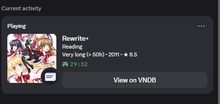

# VNPresence

Discord Rich Presence for visual novels. Launch a VN through VNPresence and your
Discord profile shows the title, the cover art, how long you have been reading,
and a link to its VNDB page - the way a normal game does.

<p align="center">
  
</p>

<p align="center"><em>What your friends see while you read. No setup: this is what the .exe does out of the box.</em></p>

- Cover art and descriptions come from [VNDB](https://vndb.org) automatically
- Auto-detect mode picks up games you start from Steam or a shortcut
- Adding a game is one line of YAML - or two clicks in the window
- Type the route or chapter you are on and it shows up straight away
- Your total reading time, counted only while you are actually in the game
- Per-game privacy, with a one-switch option to hide 18+ titles
- A plugin API for anything the defaults do not cover
- Works with emulated visual novels too - PSP, PS2, PS3, Vita, Switch
- Three themes, including a deep-blue-and-gold one for the Kingdom Hearts fans
- Updates itself: it tells you when a new build is out and installs it
- MIT licensed, no telemetry, nothing phoning home except VNDB

**Get in touch** — Discord `reevengeee` · [@Yukisobased](https://x.com/Yukisobased) ·
[open an issue](https://github.com/BasedYuki/vnpresence/issues) for bugs and for
games that will not track.

---

## Table of contents

1. [Requirements](#1-requirements)
2. [Install](#2-install)
3. [Usage](#3-usage)
4. [Adding visual novels](#4-adding-visual-novels)
5. [Discord application / client id](#5-discord-application--client-id)
6. [What the presence looks like](#6-what-the-presence-looks-like)
7. [Routes, chapters and reading time](#7-routes-chapters-and-reading-time)
8. [Privacy](#8-privacy)
9. [Plugins](#9-plugins)
10. [Troubleshooting](#10-troubleshooting)
11. [Contributing](#11-contributing)

---

## 1. Requirements

| | |
|---|---|
| OS | Windows 10/11 (primary). Linux/macOS work for the CLI; Wine/Proton launching is untested. |
| Discord | The **desktop app**, running and logged in. The browser version has no local RPC socket. |
| Python | Only if you install from source - 3.9 or newer. The `.exe` release bundles it. |
| Internet | Only for VNDB lookups. Results are cached, so you can play offline afterwards. |

Discord setting: **Settings → Activity Privacy → "Share your detected activities
with others"** must be on, or nothing shows up.

## 2. Install

### Option A - the ready-made .exe (recommended)

1. Download `VNPresence.exe` from the [Releases page](https://github.com/BasedYuki/vnpresence/releases).
2. Put it anywhere and run it. No installer, no Python.

The release also carries `VNPresence-cli.exe`. It is the same program with a
console attached, for when you want to see the output of `doctor`, `watch` or
`list`. The windowed one prints nowhere, by design.

### Option B - from PyPI

```bash
pip install vnpresence
```

### Option C - from source

```bash
git clone https://github.com/BasedYuki/vnpresence.git
cd vnpresence
pip install -e ".[dev]"
```

## 3. Usage

Double-click the `.exe` to get the window: pick a game, press **Play**.

Everything is available from the command line too:

```bash
vnpresence add "D:\VN\Steins Gate\sg.exe"   # add a game (searches VNDB for you)
vnpresence list                             # what is in your library
vnpresence play steins-gate                 # launch it and publish the presence
vnpresence play steins-gate --attach        # attach to a game that is already open
vnpresence watch -b                         # auto-detect games, in the background
vnpresence status                           # is a background watcher running?
vnpresence stop                             # stop it
vnpresence autostart on                     # start watching at every login
vnpresence note steins-gate "Chapter 3"     # say which route/chapter you are on
vnpresence stats                            # how long you have read each game
vnpresence stats rewrite --set 50h          # hours you read before VNPresence
vnpresence link rewrite https://vndb.org/v7738   # fix a wrong VNDB match
vnpresence rematch --all                    # retry games that have no cover
vnpresence rename sg "STEINS;GATE Re:Boot"  # what the presence calls it
vnpresence search "muv luv"                 # look up VNDB ids
vnpresence emulators                        # which emulator is running what
vnpresence window muv-luv BLJM60123         # which title bar means this game
vnpresence focus muv-luv                    # is it counting my reading right now?
vnpresence theme kingdom-hearts             # change the window's colours
vnpresence update                           # is there a newer build? install it
vnpresence doctor                           # check Discord, VNDB, config, paths
vnpresence plugins                          # list active plugins
vnpresence gui                              # open the window
```

VNPresence stays in the foreground while you read, updates the presence every 15
seconds, and clears it the moment the game closes. Press `Ctrl+C` (or **Stop** in
the window) to end the session early.

### Staying up to date

VNPresence asks GitHub once a day whether a newer build has been released, and
offers it:

```
A new version of VNPresence is available.

You have: 0.11.0
Latest:   0.12.0  (2026-09-19)

Download and install it now?
```

Say yes and it downloads the new `.exe`, then installs it when you close the
window and starts itself again. Windows will not let a running program
overwrite itself, so the new build is downloaded beside the old one and swapped
in afterwards - **the old build is kept as `VNPresence.exe.old`**, so a bad
update is one rename away from being undone.

From the command line:

```bash
vnpresence update --check     # just say whether there is one
vnpresence update             # ask, then install
```

Say no twice and that version is never mentioned again. Turn the whole thing
off with `check_updates: false` in `config.yaml`; nothing is ever downloaded
without a yes, and the check itself only reads a single public GitHub URL.

Installed from source or from PyPI? The check still works, and tells you to use
`git pull` or `pip install -U vnpresence` instead of replacing an `.exe` that
is not there.

### The window

```
┌─ Your library ──────────────────── Theme [Midnight ▾] [Updates] ─┐
│ [ filter…                                            ]  [Clear]  │
│ ┌──────────────────────────────────────────────────────────────┐ │
│ │ Game                    Time read   Privacy   VNDB           │ │
│ │ STEINS;GATE               12h 40m      full   v2002          │ │
│ │ Muv-Luv Alternative           58h      full   v92            │ │  ← selected
│ │ Tsukihime                 31h 05m      auto   v7             │ │
│ └──────────────────────────────────────────────────────────────┘ │
│ [ ▶ Play ]  [Add game…]                               [Stop]     │
│ [VNDB link…] [Rename…] [Time read…] [Remove]                     │
│ Route / chapter: [ Ayamine route          ] [Set] [Clear]        │
└──────────────────────────────────────────────────────────────────┘
```

- **One primary button.** Play is the only coloured one; everything else is quiet.
- **Actions that need a game grey out** until one is selected, so nothing you can
  press does nothing.
- **Type to filter** - by name or by id. `Ctrl+F` jumps to the box, `F5` refreshes.
- **Click a heading to sort**, click it again to reverse. Sort by *Time read* to
  see what you actually read.
- **Enter** plays the selected game, **Delete** removes it, **double-click** plays.

#### Themes

| | |
|---|---|
| **Midnight** | The default. Near-black with the app's own purple. |
| **Daylight** | The same window in daylight. |
| **Kingdom Hearts** | Deep ocean blue and gold. An original palette of eight colours inspired by those games - no artwork, logos or characters of theirs are used. |

Pick one from the **Theme** box in the window, or:

```bash
vnpresence theme                 # what there is, and which one is on
vnpresence theme kingdom-hearts
```

Every palette is checked against the WCAG contrast thresholds by the test
suite, so "readable" is not a matter of opinion - a theme that fails cannot be
merged.

### Where your data lives

| | Windows | Linux |
|---|---|---|
| Config | `%APPDATA%\VNPresence\config.yaml` | `~/.config/vnpresence/config.yaml` |
| Games | `%APPDATA%\VNPresence\games\*.yaml` | `~/.config/vnpresence/games/*.yaml` |
| VNDB cache | `%APPDATA%\VNPresence\cache\` | `~/.cache/vnpresence/` |
| Reading time | `%APPDATA%\VNPresence\playtime.yaml` | `~/.config/vnpresence/playtime.yaml` |
| Route notes | `%APPDATA%\VNPresence\notes\` | `~/.config/vnpresence/notes/` |
| Update state | `%APPDATA%\VNPresence\updates.json` | `~/.config/vnpresence/updates.json` |

Set `VNPRESENCE_HOME` to keep everything in one portable folder next to the `.exe`.

## 4. Adding visual novels

### The easy way

```bash
vnpresence add "D:\VN\Clannad\Clannad.exe"
```

VNPresence works out the game's name, searches VNDB with it, shows you the
matches, and writes a profile. That is all most games need.

It does **not** simply use the file name: visual novels are usually launched by
an executable named after the engine (`SiglusEngine_SteamEN.exe`,
`reallive.exe`, `game.exe`), so when the file name is an engine or a
placeholder, the folder name is used instead -
`K:\Games\Rewrite\SiglusEngine_SteamEN.exe` is added as **Rewrite**. If VNDB
still finds nothing, you are asked to type the name yourself rather than being
left with a junk title.

### When the search picks the wrong one

Names are not unique on VNDB. A sequel usually carries its parent's name, and
some titles have an unrelated namesake: searching *rewrite* returns a 2009
doujin called "rewrite" with two votes alongside the 2011 *Rewrite* with over
eight thousand. VNPresence prefers the better-known entry when several match
the name exactly, but when you already know which one you want, give it the
link and nothing is guessed at all:

```bash
vnpresence add "K:\Games\Rewrite+\game.exe" --vndb https://vndb.org/v7738
```

Already added the wrong one? Repoint it - nothing else about the game changes:

```bash
vnpresence link rewrite https://vndb.org/v7738
vnpresence link rewrite v7738 --keep-title   # keep the name you chose
```

In the window, **VNDB link…** does the same for the selected game, and the
"is this the right game?" prompt takes a link as readily as a name.

### A game with no cover

If a game shows its name but no cover art, it has no VNDB match - VNDB was
unreachable when it was added, or its first guess was turned down. Nothing else
about the game is affected, and it is one command to fix:

```bash
vnpresence rematch --all        # go back over every game with no match
vnpresence link ddlc "Doki Doki Literature Club"    # or fix one by name
vnpresence link ddlc https://vndb.org/v21905        # or by link
```

In the window: select the game and press **VNDB link…**, which takes a name as
readily as a link. `vnpresence doctor` lists the games that need it.

### Releases VNDB has no entry for

Fan translations, remakes and cuts often have no VNDB entry of their own -
STEINS;GATE Re:Boot is folded into the 2009 STEINS;GATE - so a search finds the
parent, which is the right cover and the wrong name. Take the cover and keep
your own name:

```bash
vnpresence link sg v2002
vnpresence rename sg "STEINS;GATE Re:Boot"
```

The window has **Rename…** for this, and asks before replacing a name of yours
with VNDB's.

### Games inside an emulator

Plenty of visual novels never left the PSP, the PS2, the PS3 or the Vita.
VNPresence handles those, with one extra step: the process running is the
**emulator**, and one emulator runs your whole library, so it has to be told
which game is loaded.

Every emulator puts that in its title bar, usually with the disc serial:

```
RPCS3     FPS: 59.94 | Vulkan | 0.0.42 Alpha | Muv-Luv Alternative [BLJM60123]
PPSSPP    ULJM05800 : Steins;Gate
PCSX2     Clannad
Ryujinx   Ryujinx 1.1.1 - Steins;Gate Elite v1.0.0 (01001B300B9BE000)
```

So: start the game in the emulator, then ask what it sees.

```bash
vnpresence emulators
# RPCS3 (PlayStation 3)  (pid 8124)
#   title : FPS: 59.94 | Vulkan | 0.0.42 Alpha | Muv-Luv Alternative [BLJM60123]
#   game  : Muv-Luv Alternative
#   match : BLJM60123
#
#   vnpresence add "<path to the emulator>" --window BLJM60123 \
#       --search "Muv-Luv Alternative"
```

Add it with that line, and it works like any other game - cover art, reading
time, routes, auto-detect. In the window, pick the emulator's `.exe` under
**Add game…** and VNPresence asks which game it is, with the answer already
filled in when it can see one running.

To fix or add the match later:

```bash
vnpresence window muv-luv BLJM60123
vnpresence window muv-luv --clear
```

**Use the serial where there is one.** It is exact, and it survives a
translation patch renaming the game or the emulator rewording its title bar. A
distinctive part of the name works too.

Known emulators: RPCS3, PPSSPP, PCSX2, Vita3K, Ryujinx, yuzu, Citra, Lime3DS,
Azahar, melonDS, DeSmuME, DuckStation, mGBA, VisualBoyAdvance-M, Snes9x,
RetroArch, xemu, Flycast, redream. Anything else works too - it just will not
be recognised as an emulator when you add it, so set `window_match` yourself.

**Windows only.** Reading another program's window title needs the Windows API;
on Linux and macOS an emulated game is matched by process name like anything
else, which cannot tell two games in one emulator apart.

### The profile file

Each game is one small YAML file in the games folder. Adding support for a new
visual novel means writing this file - no code, no rebuild:

```yaml
# %APPDATA%\VNPresence\games\steins-gate.yaml
title: Steins;Gate
path: D:\VN\Steins Gate\sg.exe
vndb_id: v2002
privacy: auto
```

Every key it accepts:

| Key | Default | What it does |
|---|---|---|
| `title` | *(required)* | The game's name - it becomes the "Playing …" line |
| `path` | - | The executable to launch |
| `args` | `[]` | Arguments passed to it |
| `working_dir` | folder of `path` | Working directory (some engines need it) |
| `vndb_id` | - | `v2002`, `2002` or a VNDB URL - drives cover art and info |
| `image_url` | from VNDB | Your own cover image (any public https URL) |
| `description` | from VNDB | Overrides the VNDB description |
| `process_names` | `[]` | The **real** process name if a launcher starts the game |
| `launcher_grace` | `12` | Seconds to wait for that real process to appear |
| `window_match` | - | For an emulated game: text from the emulator's title bar (a disc serial is best) |
| `chapter_pattern` | - | A regex matched against the game's own title bar; what it finds becomes the status line ([chapters](docs/chapters.md)) |
| `privacy` | `auto` if the key is missing; games added through VNPresence get `full` | `auto` / `full` / `private` / `off` - see [Privacy](#8-privacy) |
| `status_text` | `Reading` | The second presence line |
| `show_buttons` | global | Show the "View on VNDB" button |
| `show_playtime` | global | Show the total reading time for this game |
| `client_id` | global | A Discord application just for this game (advanced) |
| `plugin` | - | Name of a state plugin (see [Plugins](#9-plugins)) |
| `plugin_options` | `{}` | Options passed to that plugin |

### Series that share one launcher

Every Science Adventure release (STEINS;GATE, CHAOS;HEAD NOAH, ROBOTICS;NOTES
and the rest) is started by an identically named launcher, and they are not the
only series that does this. VNPresence matches a running process by its **full
path** first and only falls back to the file name, so three of them in one
library stay three different novels.

Two things are still worth knowing:

- **Point at the game's own executable** rather than the launcher where you
  can. It is what actually runs while you read, so the presence follows it
  exactly. VNPresence says so when you add a game whose launcher another game
  already uses.
- If a game needs administrator rights, Windows hides its path from us and only
  the name is left - which a shared launcher name cannot identify. Set
  `process_names` in that game's profile and it is unambiguous again.

### Games that use a launcher (Locale Emulator, config tools, packers)

This is the single most common problem with visual novels: you start `Game.exe`,
it spawns `game_main.exe` and exits, and a naive tracker thinks you quit after
one second. VNPresence handles this automatically - it follows the child
processes and keeps going. If a game still loses its presence right after
starting, name the real process explicitly:

```yaml
title: Some VN
path: D:\VN\SomeVN\Launcher.exe
process_names: [somevn_main.exe]
launcher_grace: 20
```

Find the real name in Task Manager while the game runs.

Examples of complete profiles live in [`examples/games/`](examples/games/).

## 5. Discord application / client id

**You do not need to do anything.** VNPresence ships with its own Discord
application and puts the game's name into the activity, so the header reads
*Playing Steins;Gate*.

A note on how that works, because most tools of this kind cannot do it: Discord
normally prints the *application's* name after "Playing", and that name is fixed
in the developer portal. Current Discord clients also accept a `name` field
inside the activity itself, and VNPresence sends it - so the header follows the
game instead of the application. If the field is ever refused, the activity is
still published without it and the title stays on the line below; nothing
breaks.

Check what your own client does:

```bash
python tools/probe_name_override.py
```

If your client is old enough to ignore the field, put the title back on the
second line:

```yaml
# config.yaml
use_activity_name: false
```

You only need your own application if you want the *fallback* name (what shows
when the field is ignored) to be something else:

1. Open <https://discord.com/developers/applications> → **New Application**.
2. Name it whatever should appear after *Playing*.
3. Copy the **Application ID** from *General Information*.
4. Put it in your config, globally or for one game:

```yaml
# %APPDATA%\VNPresence\config.yaml
client_id: "123456789012345678"
```

```yaml
# a single game overriding it
title: Steins;Gate
client_id: "987654321098765432"
```

You do **not** need to upload any images: VNPresence passes VNDB cover URLs
directly, which also sidesteps Discord's 300-asset limit per application.

Full walkthrough: [`docs/discord-setup.md`](docs/discord-setup.md).

## 6. What the presence looks like

A real session - `Rewrite+`, privacy `full`:


And what each line is:

```
Playing Steins;Gate                        <- name: the game itself
┌────────┐  Steins;Gate                    <- the activity card
│ VNDB   │  Reading                        <- details: status or plugin state
│ cover  │  Long (30-50h) • 2009 • ★ 8.9   <- state: what VNDB knows
└─────(◍)┘  01:24:07 elapsed
            [ View on VNDB ]
```

The small badge on the corner of the cover is VNPresence's own icon; hovering it
names the app, while the cover itself names the game.

An 18+ title, privacy `auto` - no name, no art, nothing identifying:

```
Playing a Visual Novel
Reading a visual novel
Reading
00:12:31 elapsed
```

With a state plugin that reads the current chapter:

```
Playing Muv-Luv Alternative
┌────────┐  Muv-Luv Alternative
│ cover  │  Chapter 3 - Ayamine route
└────────┘  02:40:09 elapsed
```

## 7. Routes, chapters and reading time

The elapsed timer says how long this session has been running. It does not say
which route you are on, or how far into a sixty-hour novel you are. Two things
fill that in.

### The route or chapter you type in

No visual novel engine reliably reports where you are in the story, and most
report nothing at all. So instead of guessing, VNPresence lets you say it:

```bash
vnpresence note rewrite "Kotori route"
vnpresence note rewrite            # what does it say right now?
vnpresence note rewrite --clear    # back to "Reading"
```

In the window, the **Route / chapter** box does the same thing. Either way a
running session picks the change up within one update - about fifteen seconds -
so you can set it as you go without restarting anything.

Some games write the chapter in their own title bar, and those need no typing at
all - one `chapter_pattern` line in the profile reads it out. A Ren'Py game can
report its labels directly with a dozen-line drop-in mod.
**[docs/chapters.md](docs/chapters.md)** covers all four ways, and is honest
about the two VNPresence will not do.

```
Playing Rewrite+
┌────────┐  Rewrite+
│ cover  │  Kotori route              <- your note, in place of "Reading"
└─────(◍)┘  Very long (> 50h) • 2011 • 12h 40m read
```

The note lives in `notes\<game>.txt`, not in the game's profile: profiles are
the part of a library people copy and share, and your route notes have no
business travelling with them.

### Total reading time

Discord's timer shows this session. VNPresence also remembers every session
before it, and puts the total on the card:

```
Very long (> 50h) • 2011 • 12h 40m read
```

```bash
vnpresence stats
# Rewrite+     12h 40m  7 sessions  last 2026-09-19
```

**Only while you are reading.** Time counts while the game is the window you
are *using* - the focused one, not merely one you can see. Two monitors make
the difference: a novel sitting open on the left while you type in Discord on
the right is in plain sight and is not being read, and it does not count. It
stops again when nothing has been touched for a while, for the evening that
ends with the novel still open. The whole card follows:

```
reading                       you are in another window     nobody is there
┌────────┐  Reading           ┌────────┐  Paused            ┌────────┐  Idle
│ cover  │  41h 51m read      │ cover  │  41h 51m read      │ cover  │  41h 51m read
└─────(◍)┘  00:30 elapsed     └─────(◍)┘                    └─────(◍)┘
```

| | counts | status | why |
|---|---|---|---|
| The game has the focus | yes | `Reading` | |
| Discord, a browser, anything else - on any monitor | no | `Paused` | you are using another window |
| The game has the focus, nothing touched for 10 min | no | `Idle` | you are not at the machine |

The timer goes away rather than ticking on beside the word - Discord draws that
timer itself and has no idea you left the room. Come back and it returns,
counting from the time you have actually read rather than from when the game
was opened. A route or chapter is kept and marked instead of thrown away:
`Chapter 3 - Ayamine route (paused)`.

**Idle time is taken back off the total**, not just stopped: the ten minutes
that passed before VNPresence could tell you had gone are subtracted again, so
walking away does not quietly buy you the length of the threshold.

```yaml
# config.yaml
focused_time_only: true    # false: count whenever the game is open
idle_after: 600            # seconds with no input; 0 switches it off
```

Ten minutes, and not the three a work tracker would use, because a voiced
scene in auto mode can run a long time without a single click. Idle detection
reads one number from Windows - how long since *any* keyboard or mouse input
reached the system, whichever program got it. Not what was typed, not where.
There is nothing to log and nothing is logged.

**Two monitors change nothing**, which is the point. Windows has exactly one
focused window - [the one "with which the user is currently
working"](https://learn.microsoft.com/en-us/windows/win32/api/winuser/nf-winuser-getforegroundwindow) -
and no such thing as one per screen. A novel left open on the left monitor
while you answer a message on the right is visible and unfocused, so it reads
as `Paused` and does not count. VNPresence never asks whether a window can be
seen, only whether it is the one being used.

Both are Windows-only: elsewhere there is no way to ask, so nothing is ever
reported as paused and time simply keeps counting.

**Verifying it yourself.** Everything above rests on two Windows calls that a
Linux test runner cannot make, so there are two ways to check them for real:
`tests/test_windows_api.py` runs them on every push (CI builds on
windows-latest), and

```bash
python tools/verify_focus.py
```

runs the whole thing on your own machine - the focused window, the idle clock,
the handback - and writes a pass/fail report beside itself. Leave the mouse
alone for the ten seconds it takes; two of the checks are about what happens
when nobody touches anything.

**When it looks wrong**, watch it decide, one line per second:

```bash
vnpresence focus muv-luv
#   pid   8112  idle      4s  Muv-Luv Alternative       -> reading
#   pid   4300  idle      2s  VNDB - Mozilla Firefox    -> paused
#   pid   8112  idle    723s  Muv-Luv Alternative       -> idle
```

A game whose window belongs to a process it started itself still counts -
the check follows the family, not one pid.

**Already read it for fifty hours?** Nothing can import that. No visual novel
engine exposes its play time in a portable way - the few that record it keep it
inside an engine-specific save format, and Ren'Py's is a Python pickle, which
cannot be read safely from outside. So you tell it once, and it counts up from
there:

```bash
vnpresence stats rewrite --set 50h       # also: "50h 30m", "50:30", "90m"
vnpresence stats rewrite --add 3h        # forgot to run it one evening
```

In the window that is the **Time read…** button.

Turn the line off for everything with `show_playtime: false` in `config.yaml`,
or for one game with the same key in its profile. A plugin that knows the real
figure can set it directly and the recorded total steps aside.

## 8. Privacy

Most visual novels carry adult content, and a Rich Presence is visible to every
friend on your list. Privacy is per game:

| Mode | What friends see |
|---|---|
| `auto` | Full details, **unless** VNDB marks the title 18+ - then `private` |
| `full` *(default)* | Title, cover art, VNDB button |
| `private` | "Reading a visual novel" - no title, no art, no link |
| `off` | Nothing at all; the game just runs |

New games are added as `full`. If you would rather have 18+ titles hidden
without thinking about it, switch the default once - in the window's
**New games** dropdown, or in `config.yaml`:

```yaml
default_privacy: auto
```

Either way you can change any single game afterwards, in the window's dropdown
or in the profile:

```yaml
privacy: private
```

Turn the automatic filter off globally with `nsfw_auto_private: false` in
`config.yaml`. VNPresence sends nothing anywhere except Discord (locally) and
VNDB (title lookups).

## 9. Plugins

Adding a **game** needs no code. Adding **behaviour** does, and that is what the
plugin API is for. A plugin is a normal Python package that registers one of
three things:

| Extension point | Purpose |
|---|---|
| `MetadataProvider` | Where a game's title/cover/description comes from (VNDB, Steam, a local file...) |
| `StateProvider` | Live session info - current chapter, route, play time |
| `PresenceFormatter` | A different presence layout altogether |

```python
# vnpresence_chapter/__init__.py
from vnpresence import PresenceState, StateProvider

class ChapterProvider(StateProvider):
    name = "chapter"

    def start(self, profile, pid):
        self.save_file = profile.plugin_options.get("save_file")

    def poll(self):
        return PresenceState(status_text=read_chapter(self.save_file))

def register(registry):
    registry.add_state_provider(ChapterProvider)
```

```toml
# the plugin's pyproject.toml
[project.entry-points."vnpresence.plugins"]
chapter = "vnpresence_chapter"
```

`pip install` it and point a game at it:

```yaml
plugin: chapter
plugin_options:
  save_file: D:\VN\MuvLuv\save\global.dat
```

The core never needs to change. Full guide with more examples:
[`docs/writing-plugins.md`](docs/writing-plugins.md).

## 10. Troubleshooting

Run `vnpresence doctor` first - it checks all of this and prints what is wrong.

| Symptom | Cause / fix |
|---|---|
| Nothing appears on your profile | Discord desktop app not running, or *Activity Privacy → Share your detected activities* is off |
| Presence disappears a second after launch | The game uses a launcher - set `process_names` (see [section 4](#4-adding-visual-novels)) |
| Title is the engine's name (`SiglusEngine`, `reallive`) | An old profile from before 0.5.0 - fix the title and `vndb_id` in its YAML, or remove and add the game again |
| Title shows but no cover art | No `vndb_id` on the profile, or VNDB was unreachable when it was added - run `vnpresence add --vndb v2002 ...` again or set `image_url` |
| Every game in my emulator shows up as the same novel | Each one needs its own `window_match` - `vnpresence emulators` prints it. Without one, the emulator answers for its whole library |
| Every game in a series shows up as the same novel | Fixed in 0.11.0 - they share a launcher and were matched by name. Update, or point each profile at the game's own .exe |
| A game shows no cover art | It has no VNDB match. `vnpresence rematch --all`, or **VNDB link…** in the window |
| A fan translation or remake shows the original's name | VNDB has no separate entry for it. Keep the cover, change the name: `vnpresence rename <game> "..."` |
| It matched the wrong entry with the same name | Repoint it with `vnpresence link <game> <vndb link>`, or **VNDB link…** in the window. The link is exact; a name is not |
| The reading total keeps rising while I am in another window | Run `vnpresence focus <game>` and move around: it prints which window has the focus, how long since you touched anything, and what that counts as. If every line says `reading`, check `focused_time_only` in `config.yaml` and that you are on 0.14.0 or newer (`vnpresence --version`) |
| It says `Idle` while I am reading | You are on a long auto-mode scene, or reading with a controller - neither reaches `GetLastInputInfo`. Raise `idle_after` in `config.yaml`, or set it to `0` |
| Reading time starts at zero for a game I have played for years | VNPresence only counts what it saw. Seed it once with `vnpresence stats <game> --set 50h`, or **Time read…** in the window |
| You see the presence but no buttons | Discord does not render buttons on **your own** profile - ask a friend, or check from another account |
| "requires elevation" / WinError 740 | The game demands administrator rights. VNPresence re-launches it through a UAC prompt - approve it. To stop being asked every time, right-click the .exe → Properties → Compatibility, or run VNPresence as administrator |
| "VNDB rate limit reached" | 200 requests / 5 minutes. Wait; cached games keep working |
| Elapsed time restarts | The tracked process restarted - usually a launcher; set `process_names` |
| Top line says "a Visual Novel", not the game | That is Discord's behaviour, not a bug - see [section 5](#5-discord-application--client-id) |

## 11. Contributing

Contributions are very welcome, especially:

- profiles for games that need a `process_names` quirk (`examples/games/`)
- plugins
- documentation and translations

```bash
git clone https://github.com/BasedYuki/vnpresence.git
cd vnpresence
pip install -e ".[dev]"
pytest && ruff check src tests
```

See [CONTRIBUTING.md](CONTRIBUTING.md). Be kind, keep PRs small, and add a test
when you change behaviour.

## License

MIT - see [LICENSE](LICENSE). VNPresence is not affiliated with Discord or VNDB.
Game titles, cover art and descriptions belong to their respective owners; cover
images are linked from VNDB, never redistributed.
